# Advanced Crosstab for EspoCRM

Pivot analytics inside EspoCRM: pick any entity, use fields of related entities as rows and columns, define several
measures (including calculated ones written in the EspoCRM Formula language), filter, drill down to the records,
export, and place the result on dashboards as a table, a chart or KPI cards.

All aggregation runs in the database. The browser only receives aggregated cells, never the raw records.

- Installable package: `./build.sh` creates `dist/advanced-crosstab-<version>.zip`. Install it from
  Administration → Extensions.
- Requirements: EspoCRM 9.0 or later, PHP 8.2 or later, MySQL/MariaDB. Tested on EspoCRM 10.0.9 with MariaDB 10.11
  and PHP 8.3. PostgreSQL is not tested.
- No core files are modified. Everything lives in the `AdvancedCrosstab` module and the `advanced-crosstab` client
  module.

## Features

| Area | What you get |
|---|---|
| Data source | Any entity the user can read, standard or custom, discovered from metadata. |
| Rows / columns | Several levels on each axis, with add, remove, reorder and swap. Expand/collapse in both directions. Sort by label, natural order or a measure, ascending or descending. Top N / Bottom N and rank at each level. |
| Related fields | Fields reached through many-to-one links, up to 3 levels deep (`account.parent.industry`, `assignedUser.name`…), picked from a searchable relationship tree. |
| Dates | Year, quarter, year-month, week and day, plus quarter, month and day of week across all years. Year then month gives a hierarchy. Datetime fields are grouped in the user's time zone. |
| Measures | Count, count distinct, sum, average, min and max of a field or of a record formula (`amount * quantity`). Each measure can have a condition (`… WHERE stage == 'Closed Won'`). |
| Calculated measures | **Aggregate formulas** such as `(SUM(amount) - SUM(cost)) / SUM(amount) * 100` and **display formulas** over other measures such as `margin / revenue * 100`. Both are correct at every level (see below). |
| Formula builder | Relationship field tree, operator buttons, function catalog, server-side validation with clear errors (`Invalid field: account.discount`, syntax errors…) and a live preview computed on real data. |
| Comparisons | Previous period (MoM, QoQ…) or same period last year (YoY), shown as % change or as a difference. |
| Filters | Nested AND / OR / NOT groups. Conditions on own or related fields: enum, boolean, number, text, links (record picker) and dates (fixed dates, ranges, and relative ones such as today, this month, last quarter or last N days). Record formula conditions. The entity's preset filters. |
| Totals | Row totals, column totals, subtotals at every level and a grand total, each one optional. |
| Drill-down | Click any cell, subtotal, total or KPI to open the matching records in EspoCRM's standard list, with sorting and paging. |
| Views | Table, column, bar, stacked bar, line, pie and donut charts, and KPI cards, all from the same result without running the query again. |
| Saved crosstabs | Save, save as (duplicate), rename, delete, favorite (stars) and share through teams and collaborators, with EspoCRM roles controlling access. A crosstab is validated before it is saved. |
| Dashboards | An "Advanced Crosstab" dashlet that shows a saved crosstab as a table, a chart or KPI cards. |
| Export | XLSX (number formats, frozen headers, hierarchy), CSV (UTF-8 with BOM, protected against spreadsheet formula injection) and PDF, all generated on the server, plus print from the browser. Large exports run as a background job and the user gets a notification with a download link. |
| Formatting | Number, integer, decimal, percent, currency and duration (h:mm). Decimals, prefix and suffix are configurable. Values use EspoCRM's thousand separator and decimal mark. |
| Languages | English and French. |

## Pipeline (ETL) view and UX (v2.4)

The **Design | Pipeline** switch in the header shows a crosstab as an ETL data flow:

**Source → Lookups → Filter → Calculate → Aggregate → Output**

- Each step is a node that shows its status: configured (green), pass-through (empty circle), no records (orange) or
  error (red). It also lists its content: the related entities used (`⟶ Account`, `«join» …`, `Σ …`), the filter
  conditions, the formulas, the group-by fields and measures, and the output options.
- The arrows between steps show how many records flow through: source records, records kept by the filters (also as
  a %), and the number of result cells. The server counts them with the user's ACL (`action/preview`).
- **Components palette**: Lookup / join, Σ related records, Filter, Calculated measure, Row, Column and Measure. Click
  a component, or drag it onto the pipeline, to add it.
- **Properties panel**: click a step and the sidebar shows only that step's settings. **Show all** brings back the
  whole sidebar.
- **Data preview**: below the pipeline, two tabs show the first 30 records of the source and of the filtered data.
  Only the fields the crosstab uses are shown, and related records appear by name.

Other UX improvements:

- **Undo / redo** with the header buttons, Ctrl+Z, and Ctrl+Shift+Z or Ctrl+Y, up to 100 steps.
- Ctrl+S saves and Ctrl+Enter refreshes.
- **Drag and drop**: drag row and column chips to reorder them or to move them between rows and columns. Measures can
  be reordered the same way.
- An **empty-state guide** appears while the crosstab has no row or column, with one-click buttons for each step.

The **data model** now uses **UML class diagram** notation:

- Each entity is a class with a stereotype (`«data source»`, `«entity»`, `«join»`, `«aggregate»`) and typed
  attributes (`Amount : Money`, `Account : Account`, `ID : Id {id}`).
- Associations are navigable (open arrowhead) and carry multiplicities: `*` on the source side, `0..1` or `1` on the
  target side.
- Aggregated one-to-many relationships (Σ) use a hollow aggregation diamond.
- Custom links are dashed `«join»` dependencies.

| | |
|---|---|
| 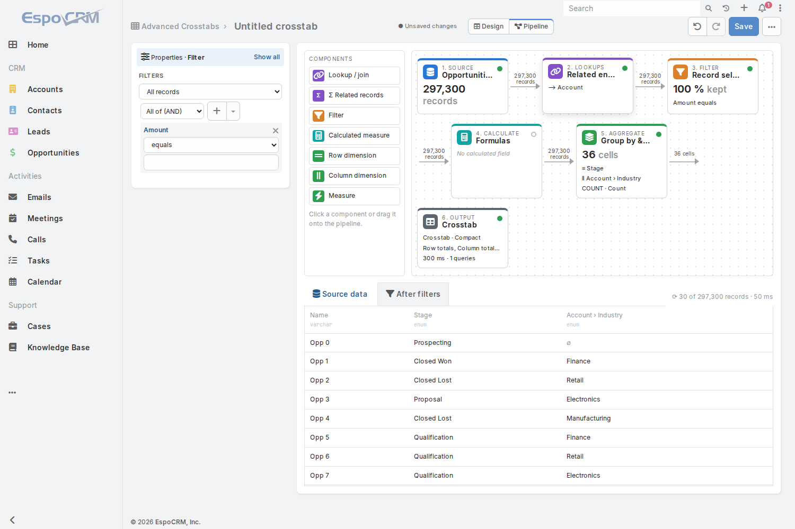 | 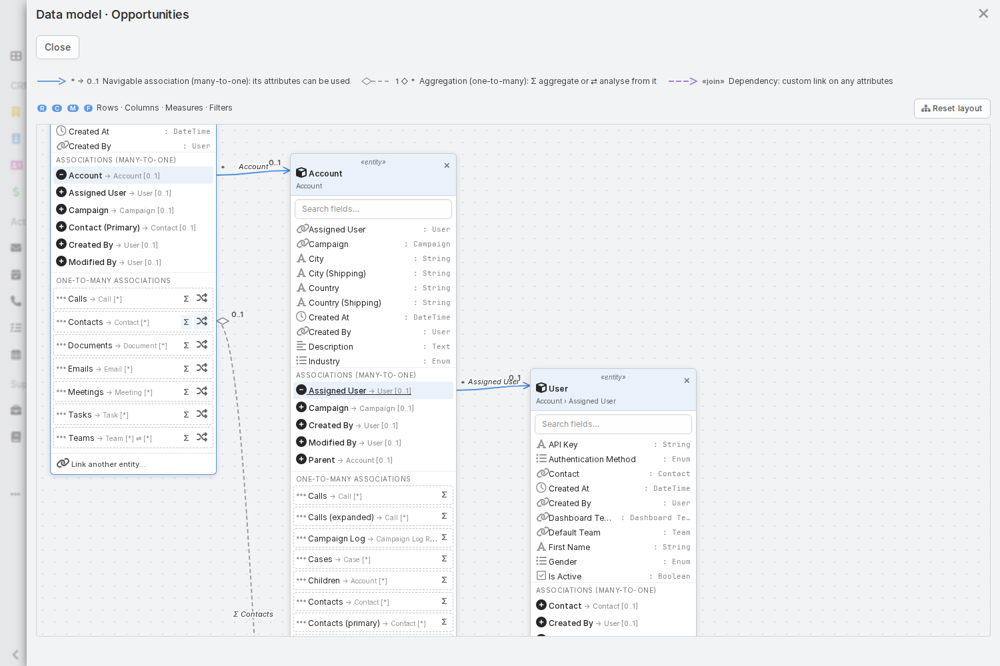 |
| 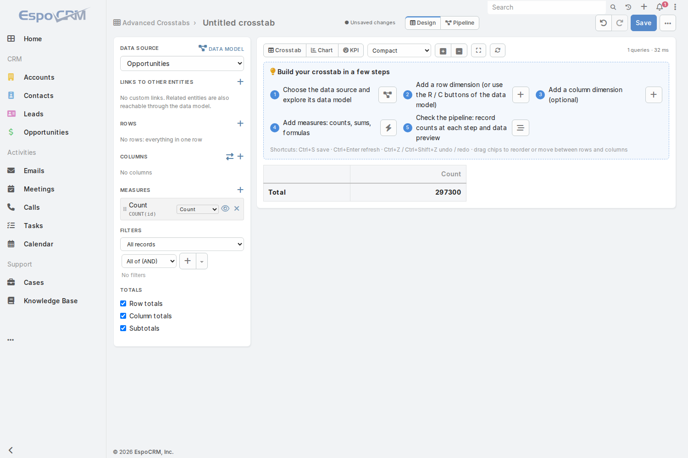 | |

## Link with any entity (v2.3)

Any entity can be brought into a crosstab, whether or not EspoCRM has a relationship for it:

| Kind of link | How | What it gives |
|---|---|---|
| **Many-to-one** relationship (Opportunity → Account) | Open it in the data model, or pick its fields in any field tree | Its fields as rows, columns, measures and filters, up to 3 levels deep |
| **Custom link** to *any* entity on *any* pair of fields (e.g. `LigneBesoinPlants.codeFiche = FicheAction.code`) | **Links to other entities ＋** in the sidebar, or **Link another entity…** at the bottom of any box in the data model | The linked entity behaves like a related entity: its fields and its own many-to-one links can be used everywhere (`xFicheAction.dRANEF`). |
| **One-to-many / many-to-many** relationships (Account → Opportunities, Account ↔ Contacts, Account → Meetings) | **Σ** next to the association in the data model | **Related measures**: sum, count, average, min or max of the related records per record, with an optional condition (`stage == 'Closed Won'`). The ⇄ button still switches the data source to that entity. |

Correctness and security:

- **Nothing is counted twice.** A custom link on a non-unique field uses the first matching record (lowest ID) for
  rows, columns and filters. Related measures are computed in a subquery grouped per record
  (`LEFT JOIN (SELECT key, SUM(x) … GROUP BY key)`), so the data-source rows are never multiplied. The tests check
  this against SQL, for example 8 accounts stay 8 next to their 279,462 opportunities.
- **The ACL applies to linked entities.** The user needs read access to the linked entity and its key fields.
  Records of the linked or related entity that the user can't read are excluded, and field-level restrictions apply
  to every field used.
- A custom link name can't hide a field or link of the data source, and links can't form a cycle.

| | |
|---|---|
| 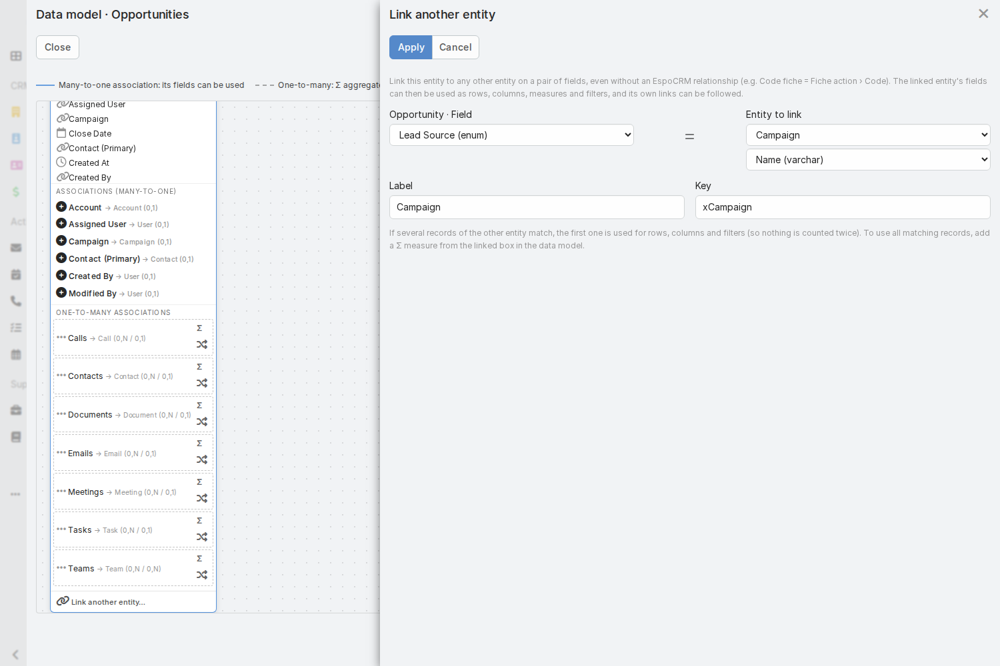 | 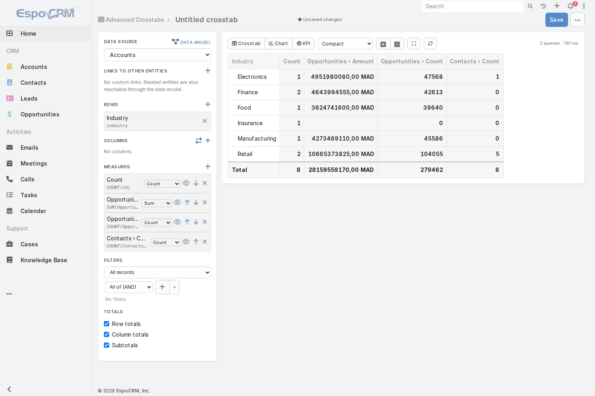 |

## Visual data model (v2.2)

Next to **Data source**, the **Data model** button opens a diagram of the entities (UML class diagram notation since v2.4, see above):

- The data source entity is a box listing its fields. Its **many-to-one associations** (Opportunity → Account,
  Account → Parent account, Opportunity → Assigned user…) are listed under it. Click one to open the related entity
  as a new box, linked by a navigable association with its multiplicities (`*` on the opportunity side, `0..1` on the
  account side). You can open up to 3 levels deep.
- Hover a field in any box and click **R**, **C**, **M** or **F** to add it to the crosstab's rows, columns,
  measures (SUM for numbers, COUNT otherwise) or filters. The relation path, such as `account.parent.industry`, is
  built from the diagram. Badges on each field show where it is already used.
- The **one-to-many and many-to-many associations** of the data source (Account → Opportunities, Opportunity →
  Meetings…) are listed dashed. Their fields can't be dimensions from this entity because each record would be
  counted several times. The ⇄ button switches the data source to that entity, from which the current one is
  reachable.
- Boxes can be dragged; **Reset layout** tidies them. Each field search box filters the fields of its own box.

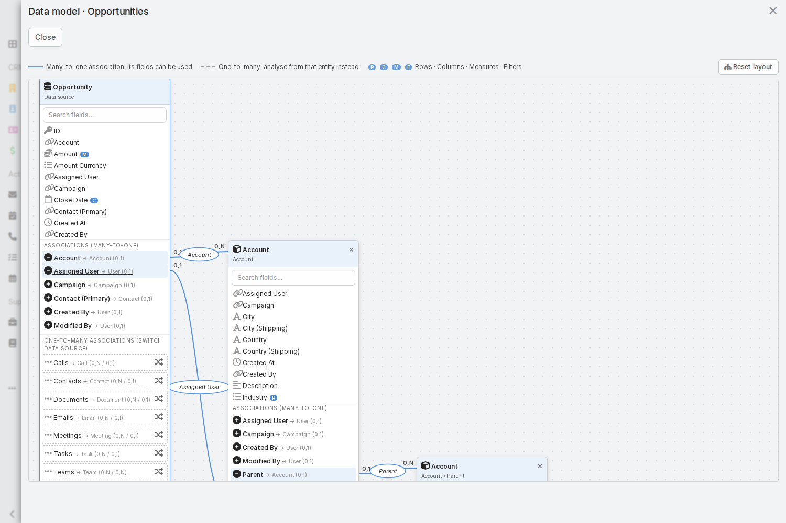

The diagram reads EspoCRM metadata and the user's ACL, so it shows standard and custom entities and links,
including links created in the Entity Manager, and hides entities and fields the user can't read.

## Options added from the dashboard pivot (v2.1)

The pivot table of the forestry dashboard (`pivotTable.js`) had several options that are now part of the extension,
re-implemented server-side and with ACL:

| Dashboard pivot | Advanced Crosstab |
|---|---|
| "Mode Pivot" toggle on each list, pivoting the filtered data | A **Pivot** button on every EspoCRM list view. It opens a crosstab with the list's current filters (text search, preset filter, "only my", field filters), which appear as a removable "List filters" chip. Field ACL applies to these filters too. |
| Default pivot per list (rows / column / metrics) | **Per-entity presets** in metadata (`clientDefs.<Entity>.advancedCrosstab`). Presets reproducing the dashboard's five pivots are in [`docs/presets`](docs/presets). |
| `[field]` formulas with `IF`, `AND`, `OR`, `COUNT`, `CONTAINS` | Same syntax accepted: `IF([amount] > 0, [amount], 0)`, `AND(…)`, `OR(…)`, `NOT(…)`, `CONTAINS([name], 'x')`, and `COUNT([field])`, which gives 1 when the field is not empty. Formulas are still compiled to SQL and validated. |
| Aggregate fields built from SUM / CNT buttons | In an aggregate formula, picking a field inserts `SUM(field)` for numbers and `COUNT(field)` for anything else. |
| "+ Valeur / Calcul": add a field with a default aggregation | **Field value (quick)…** in the measures menu: one click adds a measure, SUM for numeric fields and COUNT otherwise. |
| Aggregation dropdown on each value | **Inline aggregation** selector on each measure chip (Sum, Count, Count distinct, Average, Min, Max). |
| Cascade rows with merged cells (rowspan) | **Tabular (cascade) layout**: one column per row dimension, merged cells and "Total …" rows. The indented **Compact** layout is still available. |
| Sticky totals footer | The grand total row stays visible at the bottom while scrolling. |
| Full-screen mode | **Full screen** button (Esc to exit). |

## How it works

```text
Definition (JSON) ──► DefinitionParser ──► QueryCompiler ─────────────────────────────► PivotEngine ──► result
                                            │ PathResolver: metadata + ACL, LEFT JOINs       │ grouping-set queries
                                            │ ExpressionCompiler: Formula AST → ORM          │ or in-memory roll-up
                                            │ FilterCompiler: filter tree → ORM where        │ labels, trees, Top N,
                                            ▼                                                │ display formulas, YoY
                                     ACL-restricted base query (SelectBuilder, strict access) ┘
```

- **Formulas are parsed by EspoCRM's own Formula parser** and compiled to EspoCRM ORM expressions. Field references
  go through the metadata/ACL resolver, function names come from a whitelist, and literals are quoted by the database
  driver. User input is never concatenated into SQL.
- **Record, aggregate and display formulas are separate.** A record formula is evaluated per record (`amount - cost`).
  An aggregate formula is evaluated per group by the database (`SUM(amount) - SUM(cost)`). A display formula is
  evaluated on already aggregated measures (`margin / revenue * 100`).
- **Every level is computed from records.** Cells, subtotals and totals are grouping sets, and each needed set is
  one `GROUP BY` query. A margin % total is therefore `SUM(margin) / SUM(revenue)`, never an average of percentages.
  When every measure is decomposable (SUM, COUNT, MIN, MAX), the higher levels are rolled up in memory from the
  detail level: one query instead of up to (rows + 1) × (columns + 1), and the tests check that the numbers are
  identical.
- **Security is never bypassed:**
  - the base query uses EspoCRM's strict access control for the current user (roles, teams, own/team/all levels);
  - related entities need read access;
  - when the user can't read all records of a related entity, the join is restricted to the records they can read;
  - field-level ACL applies to every field in a dimension, measure, formula or filter, at every relationship level;
  - a shared crosstab always runs with the viewer's permissions, never the author's;
  - the result cache is per user.

The full design is in [`docs/ARCHITECTURE.md`](docs/ARCHITECTURE.md).

## Formula reference

Operators: `+ - * / %`, `== != > < >= <=`, `&&` / `AND`, `||` / `OR`, `!`, `??`.

| Group | Functions |
|---|---|
| Aggregate (aggregate formulas only) | `SUM(x)`, `AVG(x)`, `MIN(x)`, `MAX(x)`, `COUNT(id)`, `COUNT_DISTINCT(x)` or `COUNT(DISTINCT x)`. An optional second argument is a condition: `SUM(amount, stage == 'Closed Won')`. |
| Conditional | `ifThenElse(c, a, b)`, `ifThen(c, a[, b])`, `IF(c, a, b)` |
| Text | `string\concat`, `string\lowerCase`, `string\upperCase`, `string\trim`, `string\length`, `string\contains`, `string\replace` |
| Number | `number\round`, `number\abs`, `number\floor`, `number\ceil` |
| Date | `datetime\year`, `datetime\month`, `datetime\date`, `datetime\dayOfWeek`, `datetime\hour`, `datetime\minute`, `datetime\diff(a, b, 'days')`, `datetime\today()`, `datetime\now()` |
| List | `array\includes(list('a', 'b'), field)` |

Fields: `amount`, `accountId`, `account.industry`, `account.parent.industry`, `assignedUser.name`…
Display formulas reference measure keys instead of fields.

These formulas become SQL, so only functions that have an SQL equivalent are supported. Any other function is
rejected with an explicit error.

## API

| Method and path | Purpose |
|---|---|
| `GET/POST/PUT/DELETE api/v1/AdvancedCrosstab[/:id]` | Standard CRUD for saved crosstabs (record ACL). |
| `POST api/v1/AdvancedCrosstab/:id/run` | Run a saved crosstab. `{noCache}` |
| `POST api/v1/AdvancedCrosstab/action/run` | Run an unsaved definition. `{definition, noCache}` |
| `POST api/v1/AdvancedCrosstab/action/validateFormula` | `{entityType, formula, kind: record\|condition\|aggregate\|display, measureKeys}` returns `{valid, error, preview}` |
| `POST api/v1/AdvancedCrosstab/action/preview` | `{definition, stage: source\|filtered, limit ≤ 100}` returns `{count, columns, rows, durationMs}`: the pipeline's record counts and data preview (ACL applies). |
| `GET api/v1/AdvancedCrosstab/action/drillDown?payload=…` | Records of a cell, in EspoCRM's list format (`{total, list}`). |
| `POST api/v1/AdvancedCrosstab/:id/export`, `…/action/export` | `{format: xlsx\|csv\|pdf, title}` returns `{attachmentId}` or `{async: true}` |

An example definition:

```json
{
  "entityType": "Opportunity",
  "rows": [{"path": "account.industry", "limit": {"type": "top", "count": 10, "measure": "revenue"}}],
  "columns": [{"path": "closeDate", "granularity": "year"}, {"path": "closeDate", "granularity": "month", "id": "m"}],
  "measures": [
    {"key": "revenue", "label": "Revenue", "aggregation": "SUM", "expression": "amount",
     "format": {"type": "currency"}, "compare": "previousYear"},
    {"key": "won", "label": "Won", "aggregation": "SUM", "expression": "amount", "condition": "stage == 'Closed Won'"},
    {"key": "winRate", "label": "Win %", "kind": "display", "formula": "won / revenue * 100", "format": {"type": "percent"}}
  ],
  "filter": {"type": "and", "items": [
    {"type": "condition", "path": "closeDate", "operator": "currentYear"},
    {"type": "condition", "path": "account.billingAddressCountry", "operator": "equals", "value": "Morocco"}
  ]},
  "options": {"rowTotals": true, "columnTotals": true, "subtotals": true}
}
```

## Limits and configuration

Defaults are in `Resources/metadata/app/advancedCrosstab.json`. They can be overridden in `data/config.php` with
`'advancedCrosstabLimits' => ['maxCells' => 100000, …]`.

| Limit | Default |
|---|---|
| Row dimensions | 5 |
| Column dimensions | 3 |
| Measures | 25 |
| Cells | 50,000. Past this, the result is truncated and a warning is shown. |
| Joins | 10 |
| Relationship depth | 3 |
| Filter conditions | 100 |
| Formula length | 4,000 characters |
| Result cache | 120 s, per user (0 disables it) |
| Export cells before switching to a background job | 20,000 |
| Drill-down page size | 200 |

## Known limitations

- Dimensions and filters follow many-to-one links and custom links. One-to-many and many-to-many links are used
  through related (Σ) measures, which aggregate per record. To group *by* a field of the "many" side, start the
  crosstab from that entity (⇄).
- A custom link on a field that is not unique uses the first matching record for dimensions and filters. Use a Σ
  measure to aggregate all the matching records.
- Related measures don't support COUNT DISTINCT, and drilling down from one lists the data-source records.
- Inline conditions written inside an aggregate formula (`SUM(x, cond)`) are not applied when drilling down. The
  measure's own condition is.
- Datetime fields are converted to the user's *current* UTC offset. Records on the other side of a daylight-saving
  change can fall into the neighbouring hour or day.
- Currency amounts are aggregated as stored. There is no conversion between currencies.
- Totals include every record that passes the filters, including rows hidden by Top N.
- With the cache on, a permission change can take up to `cacheTtl` seconds to show. The Refresh button skips the
  cache.
- Drill-down on an *unsaved* crosstab sends the definition in the URL. Save very large definitions before drilling
  down.
- Period comparisons use the periods present in the result. If a filter excludes a previous period, its comparison
  is empty.
- Charts show at most 8 series and 40 categories, and say so when they hide some. Pie charts group the rest into
  "Other".
- Dimensions are reordered with arrow buttons; there is no drag and drop.
- The list-view Pivot button opens the designer as a new, unsaved crosstab. It doesn't switch the list in place.

## Development

- `tests/` holds the end-to-end API suite (see `tests/README.md`). Expected values come from direct SQL queries.
- The client code is AMD modules (`define(…)`) using ES classes, loaded by EspoCRM without a build step.

## Screenshots

| | |
|---|---|
| 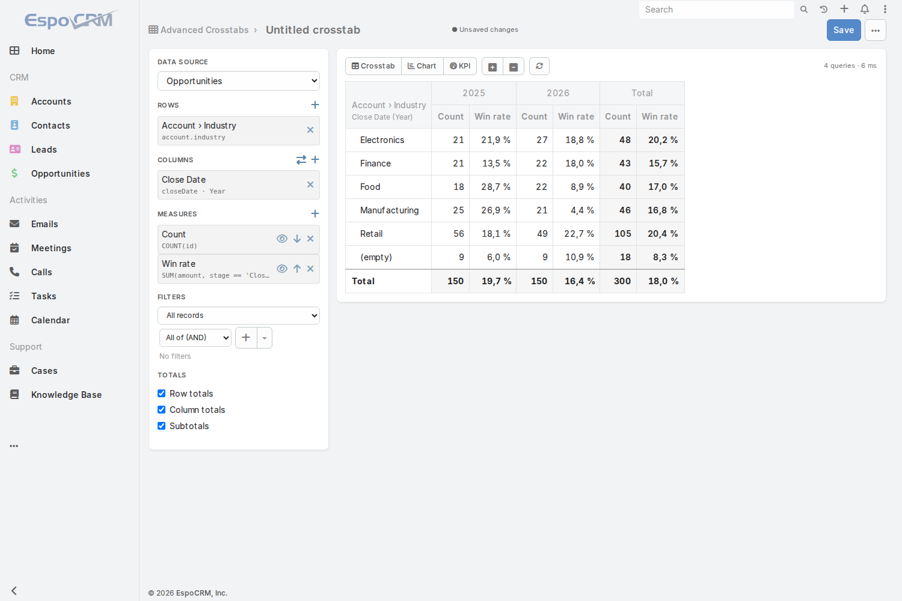 | 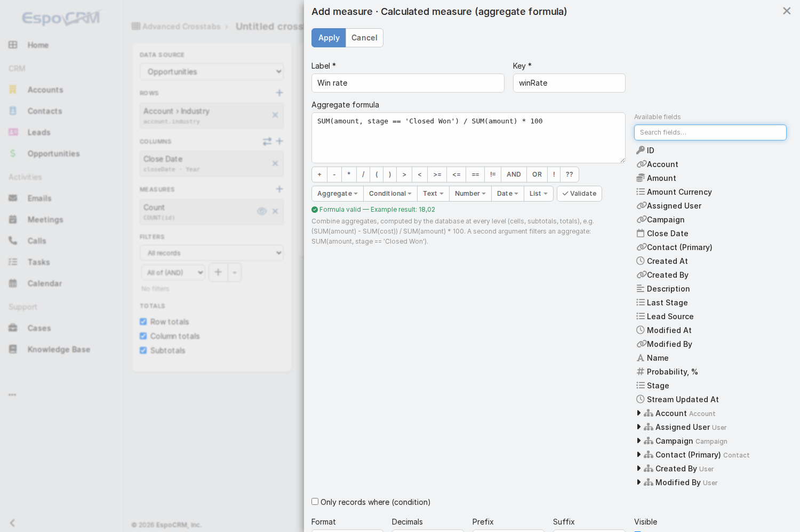 |
| 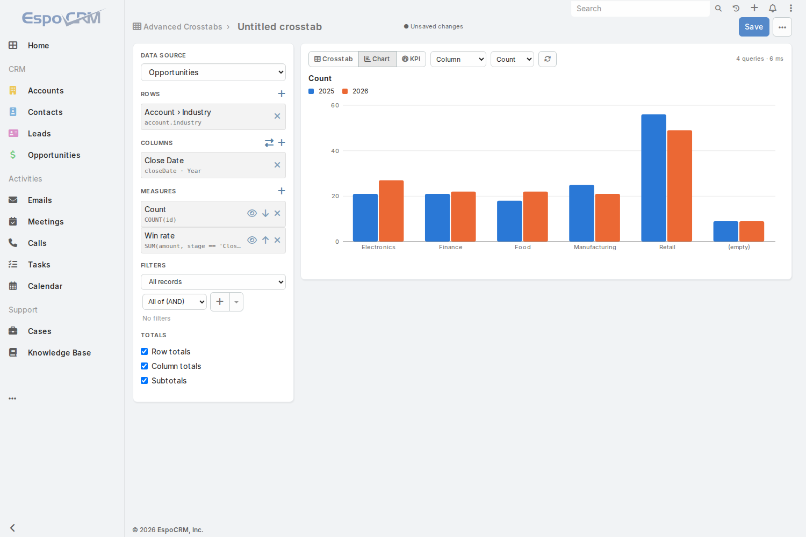 | 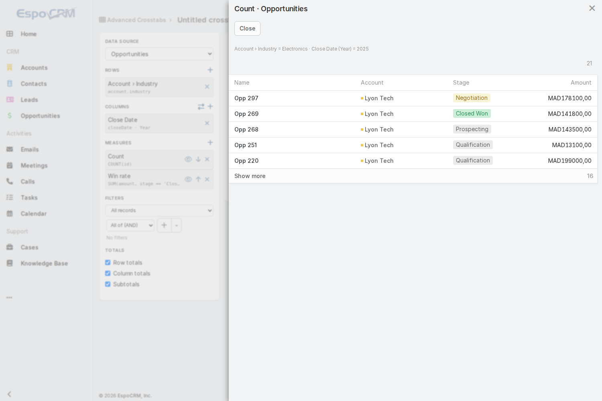 |
| 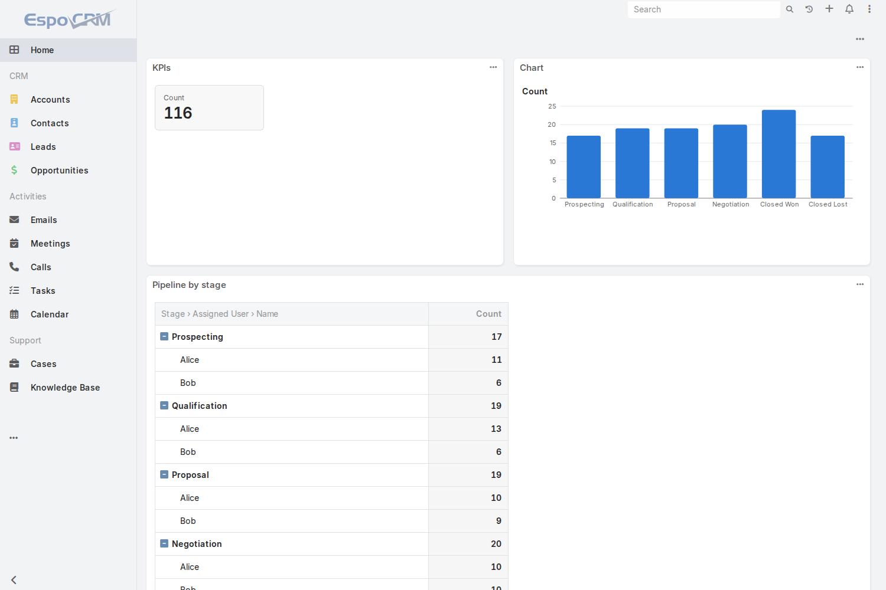 | |
